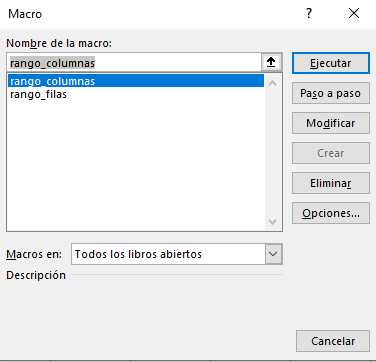

# Transposición de Matrices a Columnas ó Filas.

Muchas veces tenemos una matriz que queremos ubicarla ordenadamente en una sola columna pero ordenada con la secuencia que tienen las columas o las filas. Esta herramienta permite hacer precisamente eso.

## Pasos para ejecutar la herramieta

1. Una vez cargados ambos archivos en el entorno de desarrollador de MS Excel, desde el libro se podrá acceder a las macros y apareceran de la siguiente manera:

</a>

2. Supongamos que tenemos la sigueinte matriz y deseamos transformarla a una sola columna:

| 1 | 2 | 3 | 4 |
| 1 | 2 | 3 | 4 |
| 1 | 2 | 3 | 4 |
| 1 | 2 | 3 | 4 |
| 1 | 2 | 3 | 4 |
| 1 | 2 | 3 | 4 |
| 1 | 2 | 3 | 4 |
| 1 | 2 | 3 | 4 |
| 1 | 2 | 3 | 4 |
| 1 | 2 | 3 | 4 |

Los archivos [Matriz_Columnas.bas](https://github.com/ChrisBermudezR/VB_aplicaciones/blob/main/Matrices_Columnas_Filas/Matriz_Columnas.bas) y [Matriz_Filas.bas](https://github.com/ChrisBermudezR/VB_aplicaciones/blob/main/Matrices_Columnas_Filas/Matriz_Filas.bas) tienen el código para ejecutar las macros desde el editor de código de excel.
