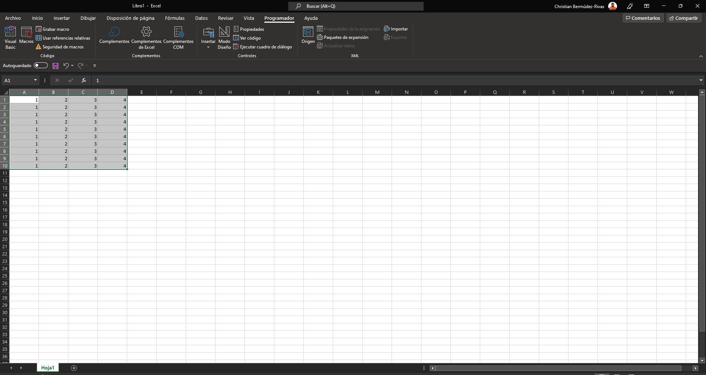
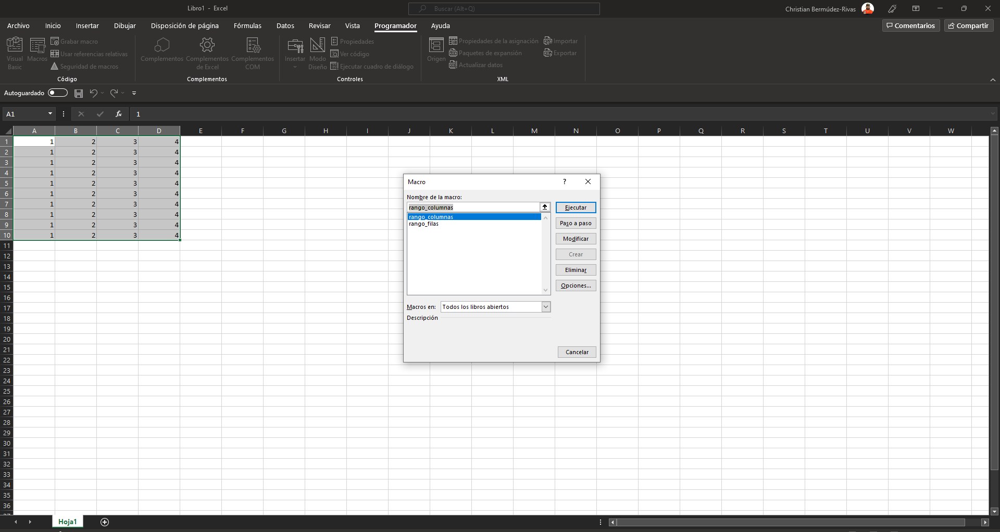
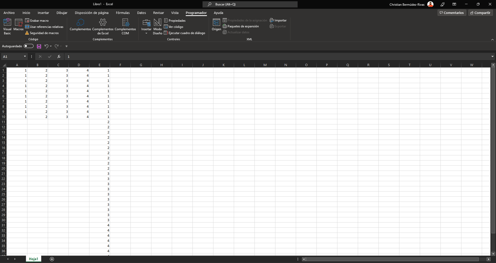
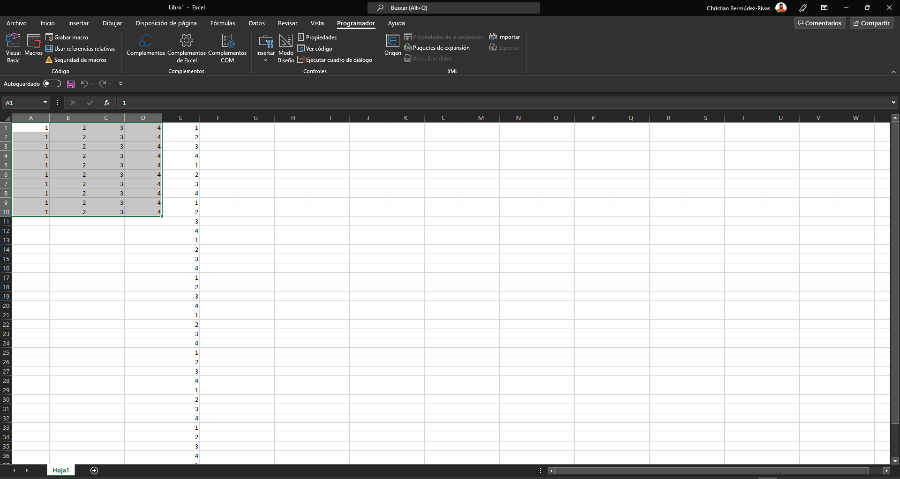

# Transposición de Matrices a Columnas ó Filas.

Muchas veces tenemos una matriz que queremos ubicarla ordenadamente en una sola columna pero ordenada con la secuencia que tienen las columas o las filas. Esta herramienta permite hacer precisamente eso.

## Pasos para ejecutar la herramieta

1. Una vez cargados ambos archivos en el entorno de desarrollador de MS Excel, desde el libro se podrá acceder a las macros y apareceran de la siguiente manera:

</a>

2. Supongamos que tenemos la siguiente matriz y deseamos transformarla a una sola columna:

| 1 | 2 | 3 | 4 |
|---|---|---|---|
| 1 | 2 | 3 | 4 |
| 1 | 2 | 3 | 4 |
| 1 | 2 | 3 | 4 |
| 1 | 2 | 3 | 4 |
| 1 | 2 | 3 | 4 |
| 1 | 2 | 3 | 4 |
| 1 | 2 | 3 | 4 |
| 1 | 2 | 3 | 4 |
| 1 | 2 | 3 | 4 |

3. Se debe seleccionar toda la matriz en la hoja de excel 

</a>

4. Una vez seleccionada se carga la macro a través del botón </a>.

</a>

5. Si se desea crear una columna donde la secuencia conserve el orden de las columnas de la matriz se debe ejecutar la herramienta "*rango_columnas*".

</a>

6. Si por el contrario se desea crear una sola columna que conserve el orden de las filas de la matriz se debe ejecutar la herramienta "*rango_filas*".

</a>

Los archivos [Matriz_Columnas.bas](https://raw.githubusercontent.com/ChrisBermudezR/VB_aplicaciones/main/Matrices_Columnas_Filas/Matriz_Columnas.bas) y [Matriz_Filas.bas](https://raw.githubusercontent.com/ChrisBermudezR/VB_aplicaciones/main/Matrices_Columnas_Filas/Matriz_Filas.bas) tienen el código para ejecutar las macros desde el editor de código de excel. Puede guardar estos archivos dadole click derecho sobre el link y "Guardar como" para descargar el archivo directamente.
