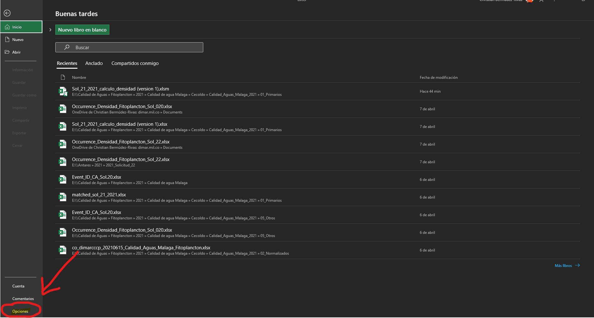
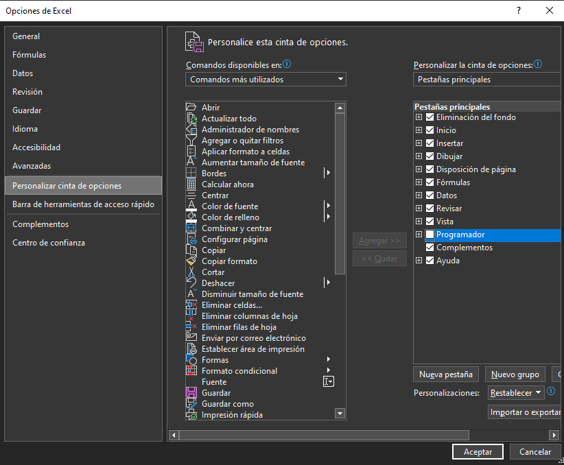
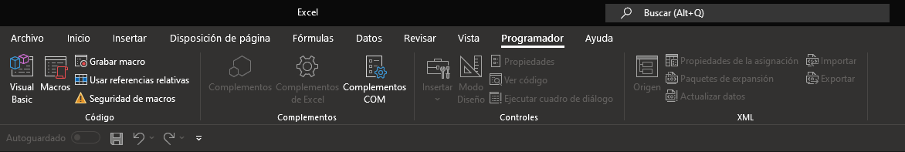
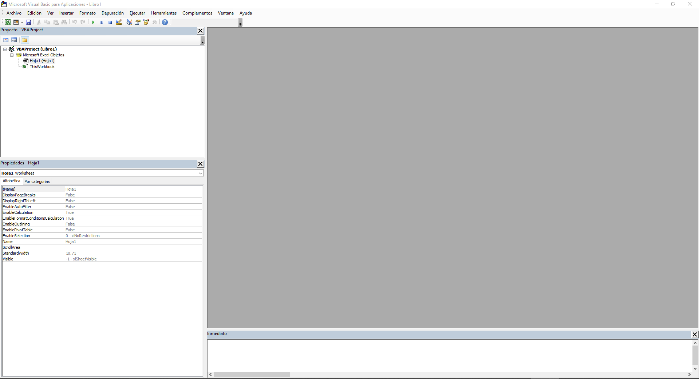
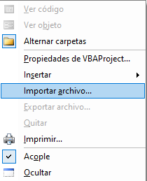
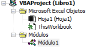
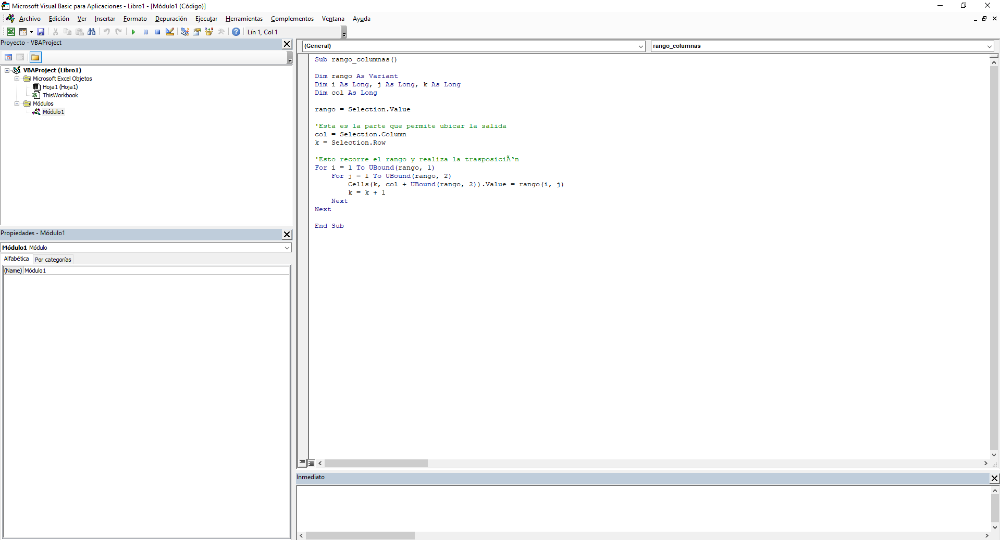
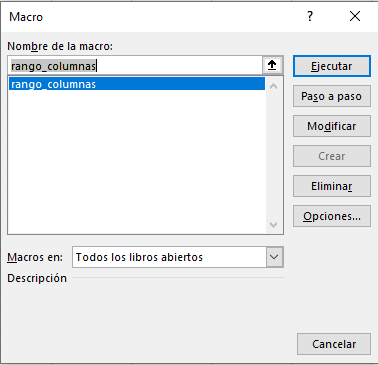
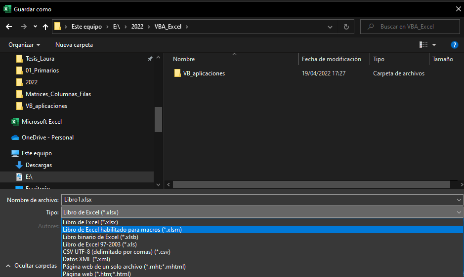

# Aplicaciones Visual Basic (VBA) para EXCEL.

A veces tenemos la necesidad de manipular datos en Excel, pero las herramientas por defecto no nos sirven, o peor aún, no sabemos que existen  :see_no_evil:.
Por esta razón en este repositorio ofreceré algunas herramientas que son muy necesarias en el día a día de la oficina cuando manipulamos datos.

La primera pregunta que hay que hacer es:

## ¿Que es Visual Basic para Aplicaciones (VBA)?

*Visual Basic* es un lenguaje de programación de Microsoft que permite acceder a la Interface de Programación de Aplicaciones (API),   crear funciones definidas por el usuario (UDF) y sobretodo la  automatización de procesos rutinarios y repetitivos a través de "***macros***", el termino corto para *macroinstrucciones*, que son una serie de pasos que resuelven problemas y se almacenan para ejecutarlos con una sola orden. ***VBA*** es el lenguaje que soporta muchas aplicaciones en el sistema operativo Windows y muchas de sus aplicaciones como MS Word, MS Outlook, MS Acess, MS PowerPoint y por supuesto MS Excel.

:computer: Existen muchos programas que usan VBA, ejemplo de ellos son:

* AutoCAD
* CorelDraw  
* LibreOffice  
* Reflection 
* SolidWorks 
* WordPerfect  
* UNICOM System Architect  
* ArcGIS 

## ¿Cómo activar el entorno de desarrollador en MS Excel?

Se debe acceder a la pestaña "Archivo" y dar click en "Opciones".

</a>

El paso siguiente es dar click en "Personalizar cinta de opciones" y dar click en "Programador"

</a>

Debe aparecer en la cinta de opciones la pestaña "Programador" y ahí encontrará la opción Visual Basic.

</a>

Una vez activada la pestaña de "Programador" se debe dar click en el botón </a> y el entorno de desarrollador se activará.

</a>

## ¿Cómo cargar una herramienta?

Por lo general los archivos que contienen una serie de comandos en VBA se guardan con una extensión .bas, este tipo de archivos se pueden importar directamente al entorno de  desarrollado de MS Excel dando click derecho sobre el VBAProject que se encuentra en la subventana del "Exlorador de Proyectos" y dando click en "Importar archivo". 

</a>

Una vez se importe el archívo, este aparecerá en  la sección de "Módulos".

</a>

Una vez importada la herramienta, esta recibirá el nombre que se asigne a la subrutina por medio de la parabra Sub. Este será en nombre con el que se llamará y se ejecuratá a la macro en el archivo .xlsx de MS Excel.

</a>

Una vez cargada la herramienta se podrá acceder a ella en el archivo de .xlsx de MS Excel por medio del botón </a>. Este paso abrirá una ventana donde se podrá acceder a la herramienta dandole click sobre el nombre y posteriormente ejecutar.

</a>

## ¿Cómo guardar un archivo de excel con una herramienta macro?

Todo archivo de excel que tenga una o varias herramientas macros cargadas debe guardarse como un "libro de excel habilitado para macros" cuya extensión será .xlsm.

</a>